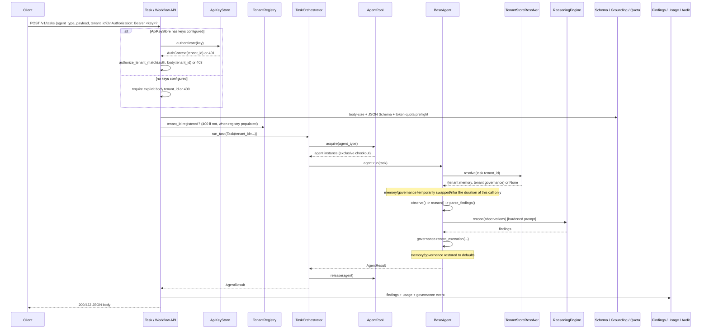

# SKEIN Architecture

This document describes how SKEIN is actually put together today. For a critical, evidence-based audit of the codebase (what's proven vs. assumed, known defects and fixes, risk register), see [docs/SKEIN-Second-Pass-Architecture-and-Technical-Assessment.md](SKEIN-Second-Pass-Architecture-and-Technical-Assessment.md) — that document is the historical audit trail; this one is the living reference.

**Verified baseline (2026-09-16):** 417 tests pass; `python -m compileall -q .` succeeds. Protocol adapters are locally tested, but live Vault, IdP, SIEM, Databricks, and multi-region integrations are not claimed.

## 1. Layer Overview

```mermaid
flowchart TB
    subgraph Entry["Entry Points"]
        SERVER["scripts/server.py"]
        PYAPI["Direct Python API"]
    end

    subgraph API["framework/api"]
        TASKAPI["Task/workflow HTTP API\nsync + async + polling"]
        FINDINGSAPI["Findings query/review API\nwebhooks + OpenAPI"]
        JOBS["JobStore"]
    end

    subgraph AuthMT["framework/auth + framework/multitenancy"]
        APIKEYS["ApiKeyStore\n(authN/authZ)"]
        PRINCIPAL["Principal / OIDC / JWKS\nRBAC policy"]
        TENANTCTX["TenantContext / TenantPolicy\nlogical + physical profiles"]
        RESOLVER["TenantStoreResolver\n(per-tenant Delta stores)"]
    end

    subgraph Core["framework/core"]
        TYPES["types.py\nTask, Finding, AgentResult,\nTenantId, CorrelationContext"]
        REGISTRY["registry.py\nAgentRegistry"]
    end

    subgraph AgentsFW["framework/agents"]
        BASE["base.py\nBaseAgent -> StructuralAgent -> DecisionAgent"]
        CATALOGUE["catalogue.py\nAgentMetadata"]
    end

    subgraph Domain["agents/ (15 domain agents)"]
        A1["supply_risk, cost_intelligence,\ndecision_audit, bias_detection,\ncontract_analysis, compliance,\nmarket_intelligence"]
    end

    subgraph Orchestration["framework/orchestration"]
        ORCH["TaskOrchestrator\nWorkflow (DAG) + WorkflowBuilder"]
    end

    subgraph Reasoning["framework/reasoning"]
        ENGINE["ReasoningEngine\n(retry + circuit breaker + prompt hardening)"]
        STRATS["Native / LangChain / LangGraph / CrewAI"]
        STUB["DryRunReasoningEngine"]
    end

    subgraph Security["framework/security"]
        SEC["SecurityEnforcer\ninput validation, PII redaction,\nrate limiting"]
    end

    subgraph Resilience["framework/resilience"]
        RETRY["RetryExecutor"]
        CB["CircuitBreaker"]
        POOL["AgentPool / AgentPoolManager"]
    end

    subgraph MemoryGov["framework/memory + framework/governance"]
        WM["WorkingMemory (per-process, session-isolated)"]
        IM["InstitutionalMemory (JSON file)"]
        GOV["GovernanceLogger\nhash-chained JSONL"]
        HC["hashchain.py\n(shared chain math)"]
        FINDINGS["Findings / Review / Feedback"]
        BILLING["UsageLedger / TokenQuotaEnforcer"]
    end

    subgraph Obs["framework/observability"]
        LOG["Structured logging"]
        MET["Prometheus metrics"]
        HEALTH["/health /ready /metrics /status"]
    end

    subgraph Platform["platform/ adapters"]
        DBX["Databricks: DeltaTableMemoryStore,\nDeltaGovernanceStore"]
        FAB["Fabric: OneLakeMemoryStore,\nFabricGovernanceLogger"]
    end

    subgraph Adapters["framework/adapters (provider-neutral boundary)"]
        WFIFACE["WorkflowEngine\nInMemoryWorkflowEngine"]
        SECRETSIFACE["SecretsProvider\nEnvironment / File / Vault"]
        IDENTITYIFACE["IdentityAdapter / Principal\nOIDC + JWKS"]
        AUDITIFACE["AuditEvent / AuditSink\nLocal + HTTP sink"]
        STORAGEIFACE["JSONL durable local adapters"]
        POLICY["TenantPolicy\nresidency + capability profile"]
    end

    SERVER --> TASKAPI
    SERVER --> REGISTRY
    SERVER --> ENGINE
    SERVER --> GOV
    SERVER --> WM
    SERVER --> POOL
    SERVER --> ORCH
    SERVER --> HEALTH
    SERVER --> RESOLVER
    PYAPI --> ORCH
    PYAPI --> REGISTRY

    TASKAPI --> APIKEYS
    TASKAPI --> PRINCIPAL
    TASKAPI --> TENANTCTX
    TASKAPI --> ORCH
    TASKAPI --> JOBS
    TASKAPI --> FINDINGSAPI
    FINDINGSAPI --> FINDINGS
    TASKAPI --> BILLING

    REGISTRY --> CATALOGUE
    BASE --> TYPES
    Domain --> BASE

    ORCH --> REGISTRY
    ORCH --> POOL
    ORCH --> Domain

    Domain --> ENGINE
    Domain --> SEC
    Domain --> WM
    Domain --> GOV
    Domain --> RESOLVER

    RESOLVER --> TENANTCTX
    RESOLVER --> DBX

    ENGINE --> RETRY
    ENGINE --> CB
    ENGINE --> STRATS
    STUB -.replaces primary strategy in tests.-> ENGINE

    GOV --> HC
    DBX --> HC

    ORCH --> WFIFACE
    GOV --> AUDITIFACE
    TENANTCTX --> POLICY
    FINDINGS --> STORAGEIFACE
    BILLING --> STORAGEIFACE

    DBX -. optional, per-tenant .-> IM
    FAB -. optional .-> IM
```

## 2. Request Lifecycle (HTTP submission)

The same parser and policy boundary serves `POST /v1/tasks/async`, `POST /v1/workflows`, and `POST /v1/workflows/async`. Async work is held by the in-process `JobStore`; workflow execution is routed through the provider-neutral `WorkflowEngine` contract. Poll with `GET /v1/tasks/async/{job_id}`. This is not crash-durable across process restarts; a durable engine remains deferred by pilot decision.

## 3. Agent Pipeline

Every domain agent (`agents/**`) follows the same three-stage pipeline, enforced by `StructuralAgent`:

1. **`observe(task)`** — pure function. Reads `task.payload` only. No LLM calls, no I/O. Computes deterministic domain statistics (e.g. `SupplierStressAgent`'s 6-signal composite score, `ShouldCostAgent`'s commodity leverage bands). Fully unit-testable without mocks — see `tests/unit/test_*_formulas.py` for hand-computed-value tests of each agent's math.
2. **`reason(observations, task)`** — calls `ReasoningEngine.reason()` with a structured prompt built from the observations. The engine wraps the call in retry + circuit breaker, and hardens the prompt (see §5) before it reaches any provider.
3. **`parse_findings(observations, reasoning, task)`** — converts the LLM's JSON response into typed `Finding` objects.

`DecisionAgent` (used by agents with authority to escalate, e.g. `InstitutionalMemoryAgent`) adds an escalation check on top: any `CRITICAL` finding, or average confidence below `MIN_CONFIDENCE_TO_DECIDE`, routes to `escalate()` instead of a normal decision record.

## 4. Multi-Tenancy Model

SKEIN supports two deployment profiles:

- **Logical isolation (default):** shared runtime with tenant-scoped authorization, rate limits, memory keys, paths, logging, governance, findings, usage, and configuration. `TenantScopedMemoryStore`, `tenant_scoped_path()`, and tenant logger adapters provide the reusable enforcement primitives.
- **Physical isolation (premium/regulated):** dedicated Delta Lake catalog/schema/container routed through `TenantContext` and `TenantStoreResolver`.

- `framework/multitenancy/context.py::TenantContext` — one tenant's routing info (catalog, schema, table names), validated against a strict identifier allowlist (`^[A-Za-z_][A-Za-z0-9_]*$`) to prevent identifier-injection when building fully-qualified table names.
- `TenantRegistry` — in-process map of `tenant_id -> TenantContext`. **Only routes to already-provisioned storage** — creating the actual catalog/container is an infrastructure/ops task (Terraform, admin script), not something this codebase does.
- `framework/multitenancy/resolver.py::TenantStoreResolver` — lazily builds and caches one `(DeltaTableMemoryStore, DeltaGovernanceStore)` pair per tenant. Returns `None` for an unregistered tenant, which `BaseAgent.run()` treats as "leave this agent's own default store in place" — not a forced fallback.
- `BaseAgent.run()` temporarily swaps `self.memory`/`self.governance` to the tenant-specific pair for the duration of one `run()` call, restoring the defaults afterward. **This is only safe when the caller guarantees exclusive access to the agent instance during `run()`** — true for `AgentPool`-checked-out instances (what `scripts/server.py` always uses), not guaranteed for instances obtained via `AgentRegistry.get_or_create()` without a pool manager.

Every `Task` carries `tenant_id` plus optional `principal_id` and roles. API keys remain the tenant authority. An optional trusted-claims path maps prevalidated OIDC claims to `Principal`; RS256/JWKS verification is available, but live IdP wiring is deployment-specific.

## 5. Security Controls

All controls in `framework/security/controls.py` are **disabled by default** and only take effect once configured — this is deliberate so library/test usage is never surprised by a behavior change:

| Control | What it does | Enabled by |
|---|---|---|
| Input length/depth validation | Rejects oversized or pathologically-nested task payloads | `security.enable_input_sanitisation: true` in `config.yaml` |
| HTTP request body limit | Rejects oversized task API bodies before JSON parsing | `security.max_request_body_bytes` (default 1 MiB) |
| Agent payload schema validation | Validates a registered agent's declared JSON schema at the API boundary | `AgentMetadata.input_schema` |
| PII redaction | Redacts email/SSN/card/phone patterns from log output | `security.enable_pii_redaction: true` |
| Secret redaction | Removes registered secret values from error/log text | `SecretsProvider` bootstrap registration |
| Rate limiting | Sliding-window limiter, keyed per tenant when `tenant_id` is set, else per agent type | `security.rate_limit_requests_per_minute` > 0 |
| Prompt-injection mitigation | Every `ReasoningEngine.reason()` call wraps the user prompt in `<<<BEGIN_UNTRUSTED_...>>>` delimiters and defangs common injection phrasing before it reaches any LLM strategy | Always on (no config flag — safe to apply unconditionally; verified not to change `DryRunReasoningEngine` test behavior) |
| Output schema validation | Validates structured LLM responses against `ReasoningRequest.output_schema` | Whenever an output schema is supplied |
| Groundedness flagging | Adds `grounding_warnings` to successful results when entity references are absent from observations | Structural agent pipeline |
| API-key authentication/authorization | Task API requires a valid key per tenant; a key cannot be used to act as a different tenant | `ApiKeyStore` populated via `SKEIN_API_KEYS` env var |
| Principal/RBAC | Normalizes OIDC claims and requires `reviewer`/`admin` for review transitions when a principal is present | Configure identity adapter/trusted gateway |
| Token quota | Rejects projected tenant token overage with 429/Retry-After | Configure `TokenQuotaEnforcer` quota |
| Secret provider | Selects environment, file, or Vault KV v2 adapter | `secrets.provider` / `SKEIN_SECRETS_PROVIDER` |

See [docs/SECURITY.md](SECURITY.md) for the full posture, including what is explicitly **not** covered.

## 6. Governance / Audit Trail

`framework/governance/hashchain.py` implements the hash-chain math (`compute_chained_entry`, `verify_chained_entries`) once, shared by two backends:

- `framework/governance/logger.py::GovernanceLogger` — local, append-only JSONL files (`executions.jsonl`, `decisions.jsonl`, `escalations.jsonl`, `audit.jsonl`). Chain state (`prev_hash`) is tracked per resolved file path at the class level and is read-compute-write-updated entirely inside one lock, so it is safe under both concurrent writers in one process and across a process restart (seeded from the file's last valid hash on construction).
- `platform/databricks/adapter.py::DeltaGovernanceStore` — the same chain algorithm, persisted as rows in a tenant-specific Delta table instead of local files, so a horizontally-scaled deployment doesn't fragment the audit trail into one disconnected chain per pod.
- `AuditSink` — a versioned `AuditEvent` can be emitted to local or generic JSON-over-HTTP sinks. The HTTP protocol is tested locally; no SIEM/OTLP vendor endpoint is certified.
- `GovernanceLogger.for_tenant()` — creates separate hash chains beneath traversal-safe tenant paths.

## 7. Resilience

- `framework/resilience/retry.py::RetryExecutor` — exponential backoff with full jitter.
- `framework/resilience/retry.py::CircuitBreaker` — per-named-resource (e.g. per LLM provider) 3-state breaker (`CLOSED → OPEN → HALF_OPEN`).
- `framework/resilience/pool.py::AgentPool` / `AgentPoolManager` — semaphore-bounded agent instance pools with warm standby, providing back-pressure (`PoolExhaustedError`) instead of unbounded instance creation.
- `framework/orchestration/orchestrator.py::TaskOrchestrator` — DAG execution over a `ThreadPoolExecutor`; a workflow-level timeout is caught (not left to raise `concurrent.futures.TimeoutError`) and outstanding tasks are marked `TaskStatus.TIMEOUT` rather than silently abandoned.
- `Task.idempotency_key` — stable across `for_retry()` (unlike `task_id`, which is regenerated per attempt). Agents that need retry-safe side effects should key their dedup guard on this; it is an opt-in tool, not an automatic guarantee (see `tests/unit/test_retry_idempotency.py` for both the failure mode it fixes and its limits).

## 8. Current Boundaries

- **Provisioning** — nothing in this codebase creates a Databricks catalog, ADLS container, or Kubernetes namespace. `TenantRegistry`/`ApiKeyStore` route to and authenticate against resources that must already exist.
- **Secrets management** — environment, atomic file, and Vault KV v2 adapters plus startup selection exist. Vault was tested against a local mock server, not a live cluster; cloud-native KMS adapters are not included.
- **Identity** — OIDC claim mapping, JWKS RS256 verification, principal propagation, and review RBAC exist. The trusted claims header must only be set by a gateway; live IdP/JWKS retrieval is not validated.
- **Audit/SIEM** — generic HTTP delivery exists and is locally tested. No target SIEM schema, credentials, retention policy, or delivery guarantee is certified.
- **Durability** — findings, feedback, usage, calibration, and governance have local file adapters. Job/workflow execution remains process-local unless a durable `WorkflowEngine` adapter is selected.
- **Live platform validation** — the Databricks adapter (`platform/databricks/adapter.py`) is validated against a fake Spark test double in this repository's test suite, not a live cluster.

For the full, evidence-graded assessment of these boundaries and everything else in the codebase, see the two documents under `docs/SKEIN-*-Assessment.md`.
