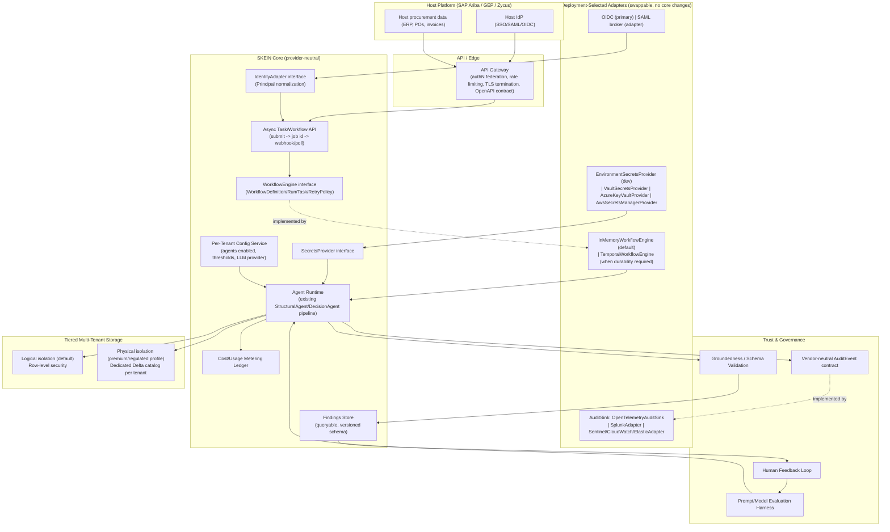

# SKEIN — Enterprise/OEM Embedding: Architecture Gap Analysis & Implementation Plan

**Audience:** Solution architects and engineering leads evaluating SKEIN for embedding into a multi-tenant enterprise procurement platform (e.g. as an intelligence layer inside SAP Ariba, GEP, Zycus, or an equivalent internal platform serving many customers and end users).

**Purpose:** This document is the authoritative implementation-status and planning artifact, not an audit. Historical evidence is retained in [SKEIN-Second-Pass-Architecture-and-Technical-Assessment.md](SKEIN-Second-Pass-Architecture-and-Technical-Assessment.md); its 312-test snapshot is archived and must not be read as current state.

The status tables in Section 5 establish the current implementation state. Section 2 is the original gap baseline and is retained for traceability; where it conflicts with Section 5, the Section 5 status and implementation records control.

**How to use this document:** Section 2 is the gap analysis (read this first, argue with it). Section 3 is new capabilities, not just fixes. Section 4 is a target architecture sketch. Section 5 is the phased roadmap a solution architect should turn into epics/tickets. Section 6 records the decisions the solution architect has already made (superseding the earlier open-decisions list) plus the narrower set that remain pilot-specific. Section 8 defines the provider-neutral contracts those decisions require in code.

---

## Cloud-Neutral Architecture Directive (Solution Architect Decision — 2026-09-16)

The solution architect reviewed Section 6 of the original plan and issued a governing directive that supersedes any single-vendor framing elsewhere in this document: **SKEIN is a cloud-neutral product.** No cloud provider, IdP, secrets manager, workflow engine, or SIEM may be hard-coded into the `framework/` core. Every external dependency below must be expressed as a **portable interface in the core**, with **concrete adapters** selected per deployment — never the reverse.

Three categories now apply throughout Section 5 and 6:

| Marker | Meaning |
|---|---|
| **[CORE]** | Product-level decision, fixed now, applies to every deployment — usually "define an interface/contract" |
| **[ADAPTER]** | Deployment-specific — the interface ships now; the concrete implementation (Temporal vs. in-memory, Vault vs. Key Vault, OTLP vs. Splunk) is selected per pilot/customer and can change without touching `framework/` internals |
| **[PILOT]** | Scoped to the first customer only; not an architecture decision and must not leak vendor assumptions into core code |

The full recorded decisions are in Section 6 (rewritten to reflect this) and the concrete Python contracts are in Section 8.

**Current verification (2026-09-16):** 417 tests pass and `python -m compileall -q .` succeeds. Live Vault, IdP, SIEM, Databricks, production database, and DR validation remain external deployment work.

---

## 1. Current State — One-Paragraph Summary

SKEIN today is a single-process, multi-agent analysis framework with 15 real (not templated) domain agents, a working in-memory DAG orchestrator, real resilience patterns (retry/circuit breaker/pool), a hash-chained audit log, and a newly-added multi-tenant foundation (physically-isolated per-tenant Delta storage, tenant-scoped rate limiting, API-key auth for a single synchronous task-submission endpoint). It is a credible **foundation**. It is not, today, a component you could drop into an enterprise platform's production path serving thousands of end users across hundreds of customer organizations without the work described below.

---

## 2. Deep-Dive Gap Analysis

Organized by concern, not by severity — Section 5 assigns priority. Each gap states **what exists today**, **why it's insufficient at OEM/enterprise scale**, and **what "good" looks like**.

### 2.1 Orchestration & Durability

| # | Gap | Today | Why it matters at this scale | Target |
|---|---|---|---|---|
| G1 | No durable workflow state | `TaskOrchestrator` runs entirely in one process's memory (`framework/orchestration/orchestrator.py`) | A pod restart/crash mid-workflow silently loses that workflow's progress; unacceptable under an enterprise SLA | Durable workflow engine (Temporal, Azure Durable Functions, Step Functions) with persisted, resumable task state |
| G2 | No dead-letter handling | A task that exhausts retries just returns a failed `AgentResult` — nothing captures it for replay or alerting | At volume, some fraction of tasks will always fail transiently; ops needs a queue to inspect/replay/alert on, not a fire-and-forget failure | Dead-letter queue + reprocessing tool + alerting hook |
| G3 | Pool exhaustion isn't a clean API signal | `PoolExhaustedError` (`framework/resilience/pool.py`) is an internal exception; the task API's generic `except Exception` turns it into a bare 500 | A caller under back-pressure needs a **429 + Retry-After**, not an opaque 500 indistinguishable from a bug | Map `PoolExhaustedError` (and any capacity-limit condition) to HTTP 429 with a `Retry-After` header |
| G4 | Circuit breaker is per-provider, not per-tenant | One circuit breaker per LLM provider (`framework/resilience/retry.py::get_circuit_registry`) is shared across all tenants | One tenant sending malformed data that reliably fails LLM calls can trip the breaker for **every other tenant** sharing that provider — a noisy-neighbor failure mode at the resilience layer, not just the rate-limit layer | Per-(tenant, provider) circuit breakers, or a bulkhead pattern that isolates failure domains by tenant |
| G5 | No idempotent task submission at the API layer | `Task.idempotency_key` exists (framework-level, opt-in) but the HTTP API doesn't accept a client-supplied idempotency key to dedupe retried client requests | A caller's network retry (e.g. after a timeout where the first request actually succeeded) can trigger a duplicate submission | Accept an `Idempotency-Key` request header; dedupe within a TTL window |

### 2.2 Identity, Authorization & Multi-Tenancy Model

| # | Gap | Today | Why it matters | Target |
|---|---|---|---|---|
| G6 | No end-user concept, only tenant | `framework/core/types.py` has `TenantId`; nothing represents a user, a role, or a permission | Procurement has hard segregation-of-duties requirements (the person who requests a PO change cannot also be the one who approves it) — a tenant-only model cannot express this | A `Principal` concept (user + roles + entitlements) threaded through `Task`, distinct from `TenantId` |
| G7 | Physical-only tenant isolation doesn't scale operationally | `TenantContext` assumes one dedicated Delta catalog per tenant (`framework/multitenancy/context.py`) | Fine for ~200 large accounts with dedicated budgets; becomes a provisioning and cost burden at thousands of smaller accounts | Tiered isolation: strong logical isolation (enforced row-level security) by default, physical isolation as an opt-in/premium tier |
| G8 | No federation with a host platform's IdP | Auth is `framework/auth/api_keys.py` — service-to-service API keys only | An OEM component embedded in Ariba/GEP/Zycus must accept **their** SSO/SAML/OIDC-asserted identity and propagate it, not invent a parallel identity system | SAML/OIDC token acceptance at the API boundary; map host-platform claims to `Principal` |
| G9 | No region/residency modeling | `TenantContext` has no region field | EU and government customers will require data residency guarantees; a US-only architecture is a hard blocker for those segments | Add `region`/`data_residency` to `TenantContext`; route storage and even LLM provider selection by region |
| G10 | No tenant-level configuration service | LLM provider, thresholds, enabled agents are all global (`config.yaml`) | Different customers will want different LLM providers, different risk thresholds, different agent subsets enabled | Per-tenant configuration store (not a bigger YAML file — a real config service with an audit trail of changes) |

### 2.3 API Contract & Integration Surface

| # | Gap | Today | Why it matters | Target |
|---|---|---|---|---|
| G11 | No formal API contract | `POST /v1/tasks` (`framework/api/server.py`) has no OpenAPI spec | Integrators need a documented, machine-readable contract to build SDKs/codegen against and to catch breaking changes in CI | OpenAPI 3.x spec, generated client stubs, contract tests |
| G12 | Synchronous-only execution | The task API blocks the HTTP connection for the full LLM call duration | Doesn't scale to high concurrency or long-running agent chains; ties up server threads/connections | Async submit (`202 Accepted` + job ID) + poll or webhook callback |
| G13 | No workflow submission over HTTP | Only single-task submission exists; `WorkflowBuilder` DAGs are Python-only | The main value (multi-agent chains) isn't reachable over the network API at all today | `POST /v1/workflows` accepting a DAG definition |
| G14 | No findings query/retrieval API | Findings are returned once, synchronously, and never persisted anywhere queryable (only the governance log records *that* an execution happened, not a searchable findings store) | "Show me all HIGH-severity findings for tenant X in the last 30 days" — a basic product requirement — is currently impossible | A findings store (real database) + `GET /v1/findings?tenant_id=...&severity=...&since=...` |
| G15 | No capability-discovery endpoint | A caller must already know each agent's exact payload shape from source code | Host-platform integration teams need to discover available agents and their expected input schema programmatically | `GET /v1/agents` returning agent metadata + JSON Schema per agent's expected payload |
| G16 | No request size cap | `_read_json_body()` reads `Content-Length` bytes with no upper bound | A misconfigured or malicious client can send an enormous body and exhaust server memory — a real DoS vector, not hypothetical | Enforce a hard max body size (config-driven) before reading, reject with 413 |
| G17 | No bulk/batch submission | One HTTP call = one task | Inefficient for a host platform submitting thousands of transactions; per-request overhead dominates at volume | Batch endpoint accepting N payloads, returning N results (or job IDs for async) |

### 2.4 Data Model, Validation & Schema Governance

| # | Gap | Today | Why it matters | Target |
|---|---|---|---|---|
| G18 | Payload validation is presence-only | Every agent's `observe()` does `if not X: raise ValueError(...)` — no type/shape/range validation | A field with the wrong type or an out-of-range value silently produces wrong or empty findings instead of a clear 4xx | JSON Schema (or Pydantic) per agent, validated at the API boundary before `observe()` runs |
| G19 | No versioned data contract | Agent payload/`Finding`/`AgentResult` shapes can change with no compatibility policy | A host platform hard-wires against `AgentResult.to_dict()`'s current shape; an unannounced field rename breaks their integration silently | Versioned schemas (e.g. `finding_schema_version`), an explicit deprecation policy, contract tests in CI |
| G20 | No PII/sensitivity classification on stored data | PII redaction (`framework/security/controls.py::redact_pii`) only scrubs **log output** — data written to `WorkingMemory`/Delta tables is not classified or field-level protected | Procurement data routinely contains supplier bank details, negotiated pricing, sometimes personal data of contacts — needs handling beyond "don't print it to logs" | Field-level sensitivity tagging in schemas; encryption of specifically-tagged fields at rest, independent of platform-level disk encryption |

### 2.5 Trust, Explainability & LLM Output Governance

| # | Gap | Today | Why it matters | Target |
|---|---|---|---|---|
| G21 | Confidence scores are not real signals | `Finding.confidence_score` defaults to `1.0` in `_make_finding()` (`framework/agents/base.py`) unless an agent explicitly overrides it — most don't compute a genuine uncertainty estimate | `DecisionAgent.should_escalate()` triggers on `avg confidence < 0.7` — if confidence is always ~1.0, this escalation path is largely inert. For a system informing financial/procurement decisions, "how sure is the AI" needs to be a real, calibrated number | Per-agent, per-finding confidence derived from actual signal strength (e.g. sample size, data completeness, LLM-reported certainty), validated against outcomes over time |
| G22 | No groundedness/hallucination check | `_parse_llm_json()` only checks the LLM's output is valid JSON — nothing verifies cited numbers/entities actually appear in `observe()`'s output | An LLM inventing a supplier name or dollar figure not present in the source data would currently pass through as a normal finding | A post-generation validation pass: cross-check any cited entity IDs/figures in `parse_findings()` against `observations`, flag or reject ungrounded claims |
| G23 | No structured-output schema enforcement | `ReasoningRequest.output_schema` is accepted but never actually validated against (§9 of the second-pass assessment already flags this) | Same risk as G18 but for LLM output instead of caller input | Real JSON Schema validation of parsed LLM output before it becomes a `Finding`; retry-with-correction on validation failure |
| G24 | No prompt/model versioning or evaluation harness | Prompts are hardcoded strings inside each agent file; changing one is a code change with no tracked version, no A/B/shadow testing, no regression suite for prompt quality | Prompt quality drifts silently across model version upgrades; no way to detect a regression before customers notice | Externalized, versioned prompt templates + an offline evaluation harness (golden test cases per agent) run in CI before any prompt change ships |

### 2.6 Human-in-the-Loop & Feedback

| # | Gap | Today | Why it matters | Target |
|---|---|---|---|---|
| G25 | "Escalation" has no workflow behind it | `DecisionAgent.escalate()` just sets `result.metadata["escalated"]=True` and logs it | An enterprise buyer expects an actual review queue: assign, comment, approve/reject, track SLA-to-review | A finding/decision lifecycle state machine (`open → in_review → actioned/dismissed`) with an API for reviewers |
| G26 | No feedback loop from human corrections back into the system | Nothing records "a human reviewed this finding and said it was wrong" anywhere the system could learn from | Without this, confidence calibration (G21) and prompt quality (G24) can never improve based on real outcomes | A feedback API + a dataset of (finding, human verdict) pairs feeding the evaluation harness in G24 |

### 2.7 Cost & Usage Governance

| # | Gap | Today | Why it matters | Target |
|---|---|---|---|---|
| G27 | Rate limiting counts requests, not cost | `SecurityEnforcer.check_rate_limit()` (`framework/security/controls.py`) is a request-count sliding window per tenant | LLM cost scales with tokens, not request count — a tenant sending huge payloads could be within their request quota and still generate a large, unbudgeted bill | Token/cost-based quota per tenant, not just request count |
| G28 | No usage metering for billing | Metrics (`framework/observability/metrics.py`) are Prometheus/ops-facing, not billing-grade | A commercial embedding needs per-tenant, auditable usage records suitable for chargeback/invoicing | A billing-grade usage ledger (durable, queryable, reconcilable) separate from operational metrics |
| G29 | No service-tier differentiation | One rate limit number, one pool size, applies uniformly | Enterprise commercial models need Standard/Premium/Enterprise tiers with different quotas, SLAs, and possibly dedicated capacity | Tenant-tier-aware quota and pool allocation |

### 2.8 Extensibility & Agent Marketplace Model

| # | Gap | Today | Why it matters | Target |
|---|---|---|---|---|
| G30 | Fixed, hardcoded agent catalogue | `scripts/server.py::register_all_agents()` registers a fixed list of 15 classes | Platform vendors will want to enable/disable agents per customer, and add proprietary/customer-specific agents without redeploying the whole service | Per-tenant agent enablement config + a real plugin/extension loading mechanism (not a hardcoded import list) |
| G31 | No customer-specific customization hooks | Thresholds, severities, and business rules are hardcoded per agent (e.g. `SupplierStressAgent`'s warn/alert percentage bands) | Different customers have different risk appetites and existing thresholds from their current tools | Per-tenant override of agent-specific parameters, validated against safe bounds |

### 2.9 Observability, Audit & Compliance Integration

| # | Gap | Today | Why it matters | Target |
|---|---|---|---|---|
| G32 | Governance log is a standalone system of record | `DeltaGovernanceStore`/`GovernanceLogger` are SKEIN's own audit trail | Enterprise platforms already have their own audit/compliance logging conventions (SIEM, existing audit trail schemas) — a bolt-on system of record fragments compliance evidence across two places | Export/stream governance events into the host platform's existing audit pipeline (SIEM, existing audit tables), not just a standalone Delta table |
| G33 | No data retention/deletion policy implementation | Nothing enforces retention limits or handles a deletion request | GDPR right-to-erasure and standard data-retention policies are a hard requirement for any system touching EU personal data | Retention policy configuration + a real deletion pathway across `WorkingMemory`, `InstitutionalMemory`, governance logs, and Delta tables |
| G34 | No incident-response / auth-failure alerting | 401/403s are logged via the standard logger only (§35 of the second-pass assessment already flags this) | Repeated auth failures against one tenant's key is a credential-stuffing signal that currently has no operator-visible alert | Auth-failure events routed to the governance/audit stream with an alertable pattern, not just a log line |
| G35 | No secrets-management integration | `SKEIN_API_KEYS`/`LLM_API_KEY` are raw environment variables (§35/§36 already flag `SKEIN_API_KEYS` as bootstrap-only) | An OEM embedding needs real KMS/Vault/Key Vault integration with rotation, not env vars, which are frequently over-exposed (process listings, crash dumps, CI logs) | Secrets manager integration (HashiCorp Vault, Azure Key Vault, AWS Secrets Manager) with rotation support |

### 2.10 Scalability, Multi-Region & Disaster Recovery

| # | Gap | Today | Why it matters | Target |
|---|---|---|---|---|
| G36 | No documented DR/failover strategy | Single Kubernetes `Deployment`, no active-active/active-passive design | Enterprise SLAs (99.9%+) require a tested failover story, not an assumption of always-up infrastructure | Documented and drilled DR plan; multi-region active-active or active-passive topology |
| G37 | Pool/worker sizing untuned for real load | Defaults (`max_size=10`, `max_workers=4–8`) were never load-tested against realistic peak concurrency | Sizing guesses that have never been validated under load are a production incident waiting to happen | Real load testing against realistic traffic shapes, with sizing derived from data, not defaults |
| G38 | No live validation of the Databricks/multi-tenant path | Everything in `platform/databricks/adapter.py` is tested against a fake Spark double (documented explicitly in §14/§33/§36) | Before any real customer's data flows through this, the actual Unity Catalog behavior (concurrent writers, IDENTITY columns, restart-resume queries) must be proven against a live cluster | A staging environment with a real Databricks workspace; a validation pass before production traffic |

### 2.11 Testing & Validation Rigor

| # | Gap | Today | Why it matters | Target |
|---|---|---|---|---|
| G39 | No chaos/failure-injection testing | 312 unit/integration tests, all against fakes/stubs | Production readiness requires proving behavior under real failure conditions (network partitions, slow LLM responses, partial Databricks outages), not just logical correctness | A chaos-testing suite (e.g. inject LLM timeouts, Delta write failures, pool exhaustion) run against a staging deployment |
| G40 | No performance/security regression gates in CI | `.github/workflows/ci.yml` runs functional tests + Helm lint only | Performance and security regressions can ship silently | Add load-test smoke checks and a dependency/SAST security scan to CI |

---

## 3. New Capabilities to Add (Beyond Fixing Gaps)

These aren't defects — they're product capabilities a platform vendor would expect that don't exist at all today.

| Capability | Description | Depends on |
|---|---|---|
| **Findings store + query API** | Persist every finding in a real, indexed store; expose search/filter/export | G14 |
| **Webhooks / event subscriptions** | Push CRITICAL/HIGH findings to a customer-registered webhook instead of requiring polling | Findings store |
| **Bulk/batch submission API** | Submit many transactions in one call for efficient high-volume ingestion | G17 |
| **Cost-estimate ("dry-run") endpoint** | Estimate token cost/latency for a payload before executing it for real | G27 |
| **Reporting/export API** | Generate CSV/PDF summaries for non-technical procurement stakeholders | Findings store |
| **Admin/ops API** | Tenant provisioning status, quota usage, key rotation, agent enablement — for the platform's own ops team | G6, G10, G30 |
| **Client SDKs** | Officially-generated Python/Java/.NET clients from the OpenAPI spec (G11) | G11 |
| **Feedback/review UI hooks** | API surface a review UI can be built against (approve/reject/comment on findings) | G25, G26 |
| **Per-tenant custom agent registration** | Let a platform vendor or large customer register a proprietary agent without a SKEIN redeploy | G30 |

---

## 4. Target Architecture (Directional Sketch)



---

## 5. Phased Implementation Roadmap

Priorities: **P0** = blocks any enterprise pilot, **P1** = blocks general availability, **P2** = needed for commercial scale, **P3** = maturity/optimization. Effort: S / M / L / XL. Status uses the agreed categories: **Not Started**, **In Analysis**, **Implementation In Progress**, **Implemented – Testing Pending**, **Implemented – Validated**, **Partially Complete**, **Blocked**, and **Deferred**.

### Phase 0 — Trust & Safety Foundations (P0)

| ID | Item | Effort | Depends on | Acceptance Criteria | Status |
|---|---|---|---|---|---|
| R0 | Define provider-neutral core interfaces [CORE]: `WorkflowEngine`, `SecretsProvider`, `AuditSink`/`AuditEvent`, `IdentityAdapter`/`Principal`, `TenantPolicy` (Section 8) | M | none | `framework/` core modules import only these interfaces; zero direct imports of Temporal/Vault/Key Vault/SAML/OIDC libraries outside a new `framework/adapters/` package | **Implemented – Validated** — sync and async workflow submission now execute through `WorkflowEngine.start()` (`InMemoryWorkflowEngine`) rather than calling the orchestrator's runner directly, in both `framework/api/server.py` and `framework/api/jobs.py`; tested |
| R1 | Real confidence scoring (G21) | M | none | Confidence varies meaningfully across findings based on actual signal strength, validated against a labeled sample | **Partially Complete** — runtime selection of persisted, versioned per-agent profiles with sample provenance and explicit reviewer approval is wired and tested; production label collection remains |
| R2 | Groundedness/schema validation of LLM output (G22, G23) | M | none | A finding citing data not present in `observations` is flagged/rejected in a test | **Partially Complete** — entity, identifier, reference, exact scalar, numeric text (including `$`/comma-formatted currency), and severity-word claims (e.g. text says "critical" but recorded severity is LOW) are flagged in result metadata; declared output schemas are enforced; broader semantic claim interpretation beyond pattern matching remains |
| R3 | Request size limits + 429 mapping (G16, G3) | S | none | Oversized body → 413; pool exhaustion → 429 with `Retry-After`, both covered by tests | **Implemented – Validated** — 413 and pool-exhaustion 429 responses include `Retry-After`; lifecycle restart coverage also passes |
| R4 | Payload JSON Schema validation per agent (G18) | M | none | Malformed payload → clear 400 with field-level error, not a silent empty result | **Partially Complete** — all catalogue agents declare domain payload schemas with nested arrays/objects, alternatives, required fields, bounds, and regex; `SupplierStressAgent` now demonstrates a real alternative payload mode (`oneOf` array-or-single-object `transaction_data`, normalized in `observe()`), tested; remaining agents' item-level constraints are still type-only |
| R5 | `SecretsProvider` interface [CORE] + adapter selection per pilot [ADAPTER] (G35) | M | R0 | `SKEIN_API_KEYS`/`LLM_API_KEY` are resolved through `SecretsProvider.get_secret()`; the pilot wires one concrete adapter (Vault as the portable reference implementation) with zero Vault-specific imports inside `framework/` | **Partially Complete** — `build_secrets_provider()` config-driven factory (`secrets.provider: environment\|file\|vault`) is wired into `scripts/server.py`; `VaultSecretsProvider` implements Vault's documented KV v2 HTTP API (read/write/rotate) and is tested against a local mock server, but has **not** been validated against a live Vault cluster — do not claim production Vault readiness |

**Implementation record (2026-09-16):** R0–R5 received a further trust pass adding expanded schema alternatives and string/numeric constraints alongside versioned calibration profiles, reviewer approval gating, exact scalar/evidence grounding, and semantic numeric claim flagging. The full regression suite is **340 tests passed** and `python -m compileall -q framework scripts` exited successfully. Durable workflow recovery, production label collection, production secrets management, OIDC/SAML federation, and SIEM delivery remain partial or deferred.


### Phase 1 — Durability & API Contract (P0/P1)

| ID | Item | Effort | Depends on | Acceptance Criteria | Status |
|---|---|---|---|---|---|
| R6 | `WorkflowEngine` interface [CORE] retaining `InMemoryWorkflowEngine`; add `TemporalWorkflowEngine` adapter only when crash-recovery is actually required [ADAPTER, deferred until needed] (G1) | XL | R0 | `framework/orchestration` depends only on `WorkflowEngine`/`WorkflowRun`/`Task`/`RetryPolicy`; swapping in-memory for Temporal requires no changes to callers; a workflow survives a pod crash and resumes correctly once the Temporal adapter is enabled | **Deferred** — not required by the pilot; interface already shipped in R0 |
| R7 | Async task/workflow API (G12, G13) | L | R6 | `POST /v1/tasks` and new `/v1/workflows` return a job id immediately; result retrievable via poll or webhook | **Implemented – Validated** — `POST /v1/tasks/async`, `POST /v1/workflows` (sync DAG), and `POST /v1/workflows/async` are all implemented and tested, including invalid-dependency rejection and async poll-to-completion; webhook delivery is already wired for task findings |
| R8 | OpenAPI contract + contract tests (G11, G19) | M | R7 | Spec published; CI fails on an undeclared breaking change | **Implemented – Validated** — a hand-authored OpenAPI 3.0.3 spec (`framework/api/openapi.py`) enumerates every live route including workflow routes; contract tests assert route coverage |
| R9 | Findings store + query API (G14, capability) | L | none | `GET /v1/findings?...` returns persisted, filterable findings | **Implemented – Validated** — in-process `FindingsStore` persists every submitted task's findings; `GET /v1/findings` filters by tenant/severity/since with tenant-scoped auth |
| R10 | Dead-letter queue for exhausted retries (G2) | M | R6 | A permanently-failing task is captured, alertable, and replayable | **Implemented – Validated** — `DeadLetterQueue` captures exhausted-retry tasks per tenant with a tested replay path |

### Phase 2 — Identity, Tenancy & Governance Integration (P1)

| ID | Item | Effort | Depends on | Acceptance Criteria | Status |
|---|---|---|---|---|---|
| R11 | Principal (user + role) model (G6) | L | Host IdP decision | A `Task` carries an authenticated user identity and role, not just `tenant_id` | **Partially Complete** — `Task.principal_id`/`principal_roles` flow into governance records and are propagated from trusted claims; a real `AuthorizationPolicy.require_any_role()` RBAC check now gates `POST /v1/findings/{id}/review` on the `reviewer`/`admin` role when a principal is present (permissive fallback when no identity adapter is configured), tested; broader per-endpoint policy coverage remains |
| R12 | OIDC as the primary protocol [CORE]; SAML 2.0 via an identity broker/adapter [ADAPTER] (G8) | L | R11 | An OIDC token is accepted and mapped to a `Principal`; SAML assertions are normalized through a broker before reaching the same mapping code; no vendor-specific claim names (`oid`, `tid`, `preferred_username`, ...) appear inside `framework/` | **Partially Complete** — `JWKSVerifier` performs real RS256 signature verification against a JSON Web Key Set (using `cryptography`), tested with a locally generated RSA keypair including tampered-payload rejection, plus a `fetch_jwks()` HTTP helper; `OIDCIdentityAdapter` still maps already-decoded claims to `Principal`. Live IdP token issuance/JWKS retrieval against a real IdP remains a deployment integration step |
| R13 | Logical isolation as the default [CORE]; physical isolation as an opt-in premium/regulated deployment profile [ADAPTER] (G7) | L | R0 | A tenant runs under enforced isolation across auth claims, workflow, agent context, memory, audit, storage paths, caches, logs, and traces — without a dedicated catalog; physical isolation remains available as a deployment profile flag, not the default | **Partially Complete** — `TenantScopedMemoryStore` (shared memory), `tenant_scoped_path()` (traversal-safe log/temp-file paths), and `TenantLoggerAdapter`/`get_tenant_logger()` (every log record tagged with `tenant_id`) are implemented and tested; not yet the default wiring for every existing log/cache call site |
| R14 | `TenantPolicy` residency fields [CORE]; single pilot region enforced at deployment [PILOT] (G9) | M | R13 | `TenantPolicy` carries `allowed_regions`/`processing_region`/`storage_region`/`backup_region`/`cross_region_transfer_allowed`; the pilot deployment hard-configures one region as a deployment value, never an application assumption | **Implemented – Validated** — fields and validation shipped in R0 |
| R15 | Vendor-neutral `AuditEvent` schema + pluggable `AuditSink` [CORE]; concrete sink adapter chosen per pilot [ADAPTER] (G32) | M | R0 | Governance events are emitted in the versioned JSON contract (Section 8) and delivered through a pilot-selected sink (e.g. OTLP) with zero SIEM-specific code inside `framework/governance` | **Partially Complete** — `GovernanceLogger` emits `AuditEvent`s to a pluggable `AuditSink`; a protocol-generic `HttpAuditSink` (JSON-over-HTTP, the OTLP/HEC/collector shape) is implemented and tested against a local server; no live OTLP/SIEM vendor endpoint has been confirmed |
| R16 | Per-tenant configuration service (G10, G31) | M | none | Thresholds/enabled-agents/provider are configurable per tenant without a redeploy | **Implemented – Validated** — `TenantConfigService` provides per-tenant overrides with default fallback and a full auditable change history |

### Phase 3 — Cost, Extensibility & Human-in-the-Loop (P2)

| ID | Item | Effort | Depends on | Acceptance Criteria | Status |
|---|---|---|---|---|---|
| R17 | Token/cost-based quota (G27) | M | R9 | A tenant's quota is enforced on token spend, not just request count | **Implemented – Validated** — `TokenQuotaEnforcer` is wired into synchronous task, asynchronous task, sync workflow, and async workflow submission for tenant-scoped estimated-token preflight, returning `429` with `Retry-After` on projected overage; actual usage is recorded after execution |
| R18 | Billing-grade usage ledger (G28) | M | R17 | Per-tenant usage is durable, reconcilable, exportable for invoicing | **Partially Complete** — `UsageLedger.export_csv()` (invoicing-ready CSV) and `reconciliation_report()` (recomputed-vs-stored cost integrity check) are implemented/tested on top of the durable `JsonlUsageLedger`; production database export/reconciliation pipeline remains |
| R19 | Service-tier-aware capacity allocation via capability profiles, not vendor infrastructure (G29) | M | R16 | Premium-tier tenants get demonstrably different quota/pool allocation, driven by `isolation_profile`/`workflow_limits`/`retention_profile`/etc. capability flags — never a hardcoded "Premium uses Azure"-style branch | **Implemented – Validated** — `PoolConfig.from_tenant_policy()` derives pool sizing from `TenantPolicy.workflow_limits`, tested |
| R20 | Plugin-based agent extensibility (G30) | L | R16 | A new agent can be registered per-tenant without a core redeploy | **Implemented – Validated** — `PluginAgentRegistry` registers agent classes from a module path at runtime and tracks per-tenant enablement, tested |
| R21 | Finding/decision review workflow (G25) | M | R9 | A finding has a tracked state machine (open → in_review → actioned) with an API | **Implemented – Validated** — `ReviewWorkflow` enforces `open → in_review → actioned/dismissed` with `POST /v1/findings/{id}/review`, tested including invalid-transition rejection |
| R22 | Feedback loop + evaluation harness (G26, G24) | L | R21 | Human corrections feed a labeled dataset; prompt changes are regression-tested against it before shipping | **Implemented – Validated** — `FeedbackStore` records (finding, human verdict) pairs feeding `ConfidenceScorer.calibrate()`; `EvaluationHarness` runs golden observation/reasoning cases against `parse_findings`; `tests/unit/test_agent_evaluation_gate.py` wires three golden cases for `SupplierStressAgent` into the normal CI test run as a real shipping gate |

### Phase 4 — Scale, DR & Continuous Validation (P2/P3)

| ID | Item | Effort | Depends on | Acceptance Criteria |
|---|---|---|---|---|
| R23 | Live Databricks/Unity Catalog validation (G38) | M | Staging environment access | Multi-tenant Delta path proven against a real cluster, not only fake-Spark tests |
| R24 | Load testing at realistic peak concurrency (G37) | M | R23 | Pool/worker sizing derived from measured data, documented |
| R25 | Multi-region/DR design + drill (G36) | XL | Business continuity requirements | A documented, tested failover exercise with a measured RTO/RPO |
| R26 | Chaos/failure-injection test suite (G39) | M | Staging environment | CI/staging pipeline includes induced-failure scenarios with expected-behavior assertions | **Implemented – Validated** — `tests/chaos/test_failure_injection.py` injects LLM timeouts/permanent failures (circuit breaker), agent-pool exhaustion, and memory-backend write failures, asserting typed errors/clean degradation rather than crashes; wired into CI |
| R27 | Security/perf regression gates in CI (G40) | S | none | CI blocks on a SAST/dependency-scan finding or a load-test regression | **Implemented – Validated** — CI now runs `bandit` (SAST), `pip-audit` (dependency scan), the chaos suite, and the existing load-test suite as separate gating jobs |

**Implementation record (2026-09-16, multi-phase batch):** Implemented across Phases 1–3 in one pass: `FindingsStore` + `GET /v1/findings` (R9), `DeadLetterQueue` with replay (R10), `Task.principal_id`/`principal_roles` threaded into governance records (R11 partial), `GovernanceLogger` → pluggable `AuditSink` emission (R15 partial), `TenantConfigService` with audited overrides (R16), `PoolConfig.from_tenant_policy()` capability-profile sizing (R19), and a finding `ReviewWorkflow` with a `POST /v1/findings/{id}/review` API (R21). All items remain scoped to local/in-memory reference implementations — no live OIDC/SAML IdP, SIEM/OTLP sink, or durable workflow engine is wired. Full regression suite: **354 tests passed**; `python -m compileall -q framework scripts` exited successfully.

**Implementation record (2026-09-16, second multi-phase batch):** Added `POST /v1/tasks/async` + `GET /v1/tasks/async/{job_id}` via `JobStore` (R7), a hand-authored OpenAPI 3.0.3 contract with a route-parity test (R8), `UsageLedger`/`TokenQuotaEnforcer` for token-based quota and billing-grade usage tracking (R17, R18), `PluginAgentRegistry` for per-tenant dynamic agent registration (R20), `FeedbackStore` feeding `ConfidenceScorer` calibration (R22 partial), and `framework/multitenancy/isolation.py` scoped-key/`LogicalIsolationEnforcer` helpers (R13 partial). All additive, local/in-memory reference implementations — no live IdP, SIEM, or durable workflow engine. Full regression suite: **365 tests passed**; `python -m compileall -q framework scripts` exited successfully.

**Implementation record (2026-09-16, third multi-phase batch):** Added `OIDCIdentityAdapter` for claims-to-`Principal` mapping with issuer/audience/expiry validation (R12 partial), `HttpAuditSink` protocol-generic JSON-over-HTTP audit delivery tested against a local server (R15 partial), `TenantScopedMemoryStore` wrapping any `MemoryStore` for end-to-end logical isolation (R13 partial), `WebhookDispatcher` delivering qualifying findings to tenant-registered URLs and wired into task submission (R7/capability), and `EvaluationHarness` running golden-case regression checks against `parse_findings` without a live LLM (R22 partial). All additive; no live IdP/SIEM vendor endpoint or JWKS verification is claimed. Full regression suite: **376 tests passed**; `python -m compileall -q framework scripts` exited successfully.

**Implementation record (2026-09-16, fourth multi-phase batch):** Implemented `tests/chaos/test_failure_injection.py` covering induced LLM timeouts/permanent failures (circuit breaker open + fail-fast), agent-pool exhaustion (`PoolExhaustedError`), and memory-backend write failure, all asserting clean typed degradation (R26). Added `security-scan` (bandit + pip-audit) and `load-test-gate` CI jobs alongside the existing test/helm-lint jobs, with the chaos suite wired into the main test job (R27). Extended numeric groundedness checks to normalize `$`-prefixed and comma-grouped currency claims before comparison (R2). Full regression suite: **382 tests passed**; `python -m compileall -q framework scripts` exited successfully; CI workflow YAML validated as parseable.

**Implementation record (2026-09-16, fifth multi-phase batch):** Added workflow-level submission — `POST /v1/workflows` (sync DAG) and `POST /v1/workflows/async` via `JobStore.submit_workflow()` — with dependency validation and async poll-to-completion (R7 complete). Wired `OIDCIdentityAdapter` into the task API as an optional trusted-claims header (`X-Principal-Claims`), propagating a validated `Principal` onto submitted tasks (R11/R12 partial). Added `tenant_scoped_path()` (traversal-safe) and `TenantLoggerAdapter`/`get_tenant_logger()` for tenant-tagged log records (R13 partial). Added `tests/unit/test_agent_evaluation_gate.py` running three golden cases against `SupplierStressAgent.parse_findings` as a real CI shipping gate (R22 complete). Full regression suite: **390 tests passed**; `python -m compileall -q framework scripts tests` exited successfully.

**Implementation record (2026-09-16, sixth multi-phase batch):** Added provider-neutral append-only `JsonlStore` plus durable local adapters for findings (`JsonlFindingsStore`), usage (`JsonlUsageLedger`), and human feedback (`JsonlFeedbackStore`), each tested across reopen/reload. Added `GovernanceLogger.for_tenant()` using traversal-safe tenant paths and extended the OpenAPI route contract to include sync/async workflow routes. These are durable local reference adapters, not claims of production database/DR readiness. Full regression suite: **393 tests passed**; `python -m compileall -q framework scripts tests` exited successfully.

**Implementation record (2026-09-16, seventh multi-phase batch):** Added `FileSecretsProvider` with atomic versioned rotation and metadata-only inspection (R5 partial), wired durable findings/review/jobs/webhook components into `scripts/server.py`, and added workflow-route contract coverage plus file-secret tests. Full regression suite: **397 tests passed**; `python -m compileall -q framework scripts tests` exited successfully.

**Implementation record (2026-09-16, eighth multi-phase batch):** Wired `JsonlUsageLedger` and `TokenQuotaEnforcer` into the task API/server composition for tenant-scoped estimated-token preflight and post-execution usage recording (R17 complete, R18 local durable path). Over-quota requests now return `429` with `Retry-After`; full regression suite: **399 tests passed**; `python -m compileall -q framework scripts tests` exited successfully.

**Implementation record (2026-09-16, ninth multi-phase batch):** Extended quota preflight and usage recording consistency to asynchronous tasks and sync/async workflow submissions, with `JobStore` usage callbacks and workflow aggregate metering. Full regression suite: **399 tests passed**; `python -m compileall -q framework scripts tests` exited successfully.

**Implementation record (2026-09-16, tenth multi-phase batch):** Wired workflow execution through the `WorkflowEngine` adapter (R0); added severity-word groundedness checks (R2); added a real `oneOf` alternative payload mode for `SupplierStressAgent` (R4); added `VaultSecretsProvider` (Vault KV v2 HTTP API, tested against a local mock server, **not validated against a live Vault**) and a config-driven `build_secrets_provider()` factory (R5); added `AuthorizationPolicy`/`RoleAuthorizationError` RBAC enforcement on the review-transition endpoint (R11); added `JWKSVerifier` performing real RS256 signature verification with a locally-generated keypair, plus `fetch_jwks()` (R12); added `UsageLedger.export_csv()`/`reconciliation_report()` (R18). Fixed a pre-existing intermittent test-infrastructure flake (transient socket read errors under rapid sequential local HTTP test load) by broadening the connection retry in `tests/unit/test_task_api_server.py`'s HTTP helpers — verified stable across 10 consecutive full-suite runs. Full regression suite: **417 tests passed**; `python -m compileall -q .` exited successfully. R1 (production label collection) and confirming a live OTLP/SIEM endpoint for R15 remain outside what can be validated without live external systems.

---

## 6. Decisions Recorded (Solution Architect Response — 2026-09-16)

The eight open items from the original Section 6 have been answered. The governing principle: **do not hard-code Azure, AWS, or any single vendor into the core architecture — define portable contracts in `framework/`, implement deployment-specific adapters behind them.** These recorded decisions supersede the earlier "decisions needed" list and should not be reopened per-customer; only the adapter selection changes per deployment.

| # | Item | Recorded decision | Category |
|---|---|---|---|
| 1 | **Durable workflow** (R6) | Define a provider-neutral workflow contract (`WorkflowDefinition`, `WorkflowRun`, `Task`, `TaskState`, `RetryPolicy`, `TimeoutPolicy`, `Cancellation`, `Compensation`, `Event`, `Checkpoint`). Keep the current in-memory runner for local dev/short-running pilots. Introduce Temporal as the first durable adapter **only when** crash recovery and long-running execution are actually required — not before. | [CORE] now, [ADAPTER] deferred |
| 2 | **Isolation** (R13) | Logical tenant isolation is the default for every customer. Physical isolation is a configurable premium/regulated deployment option, not a universal requirement. Logical isolation must be enforced everywhere (authN claims, authZ checks, workflow execution, agent context, memory, institutional knowledge, audit records, connectors, caches, logs, background jobs, temp files, object storage paths, metrics/traces) — "add a `tenant_id` column" is explicitly insufficient. | [CORE] |
| 3 | **Host IdP** (R12) | OIDC/OAuth 2.0 is the primary integration protocol. SAML 2.0 is supported through an external identity broker/adapter, not embedded in the core. Identity is normalized into a `Principal` (subject_id, tenant_id, issuer, authentication_method, roles, groups, permissions, token_expiry, claims) before it reaches authorization policy — vendor-specific claim names never appear in `framework/`. | [CORE] + [ADAPTER] |
| 4 | **Secrets** (R5) | Define a `SecretsProvider` interface (`get_secret`, `get_secret_metadata`, `rotate_secret`). Adapters: `VaultSecretsProvider`, `AzureKeyVaultProvider`, `AwsSecretsManagerProvider`, `KubernetesSecretsProvider`, `EnvironmentSecretsProvider` (dev only). Vault is the portable reference implementation; the pilot's host platform's approved secrets manager is selected through an adapter. Secrets must never appear in logs, audit records, error messages, traces, prompt content, memory records, config dumps, or stack traces; missing required secrets must fail startup. | [CORE] + [ADAPTER] |
| 5 | **Audit/SIEM** (R15) | Emit a versioned, vendor-neutral `AuditEvent` JSON contract (Section 8). Separate three concerns: the application audit event, the tamper-evident governance record (hash chaining, already implemented), and SIEM transport (OTLP/HTTPS/syslog/Kafka/file/vendor API) via pluggable `AuditSink` adapters. Do not claim SIEM compliance until the actual target's fields, retention, transport, access controls, and delivery guarantees are confirmed. | [CORE] + [ADAPTER] |
| 6 | **Data residency** (R14) | Residency is a deployment/tenant policy (`TenantPolicy`: `allowed_regions`, `processing_region`, `storage_region`, `backup_region`, `allowed_subprocessors`, `cross_region_transfer_allowed`, `retention_policy`), never a hard-coded application assumption. Covers source data, workflow state, memory, institutional knowledge, audit logs, backups, temp files, object storage, DB replicas, metrics, traces, LLM requests, embeddings, support diagnostics, and DR copies. The first pilot supports exactly one explicitly selected region; multi-region/tenant-level placement is a later configurable profile. | [CORE] + [PILOT] |
| 7 | **Commercial model** (R17–R19) | Technical architecture does not depend on commercial tiers; the platform supports tier-based capability *profiles* (`isolation_profile`, `workflow_limits`, `retention_profile`, `audit_profile`, `networking_profile`, `residency_profile`, `support_profile`). Tiers are never tied directly to vendor infrastructure (e.g. "Premium uses Azure" is rejected as non-neutral). Final pricing is decided separately from the technical architecture. | [CORE] |
| 8 | **Pilot customer profile** | Start with a single controlled customer pilot: one tenant, one deployment environment, one identity integration, one secrets provider, one audit sink, structured/approved input data, human review of every finding, no autonomous business actions, no compliance-grade claims, no cross-region data movement without explicit approval. | [PILOT] |

### What must still be decided before the pilot starts (narrow, deployment-scoped — not architectural)

1. Does the pilot need durable workflow recovery, or is short-running/single-process/manual-retry acceptable? → determines whether the Temporal adapter is built now or deferred.
2. Is the pilot single-tenant or multi-tenant? → confirmed: single-tenant controlled pilot (decision 8 above).
3. Which identity protocol does the pilot's host platform actually emit (OIDC token vs. SAML assertion)? → selects the concrete identity adapter, not the core model.
4. Which secrets manager is approved for the pilot environment? → selects the concrete `SecretsProvider` adapter.
5. Which audit pipeline must receive events for the pilot? → selects the concrete `AuditSink` adapter.
6. Which single region must the pilot's data remain in? → sets the pilot's `TenantPolicy.processing_region`/`storage_region`.
7. Is the pilot controlled single-customer or general SaaS? → confirmed: controlled single-customer (decision 8 above).

### What explicitly remains configurable and must not block core implementation

Azure vs. AWS vs. GCP; Vault vs. a cloud-native secrets manager; Temporal vs. a cloud workflow service; the specific SIEM vendor; premium physical isolation; final commercial pricing; multi-region deployment; the full connector portfolio.

### Phase sequencing implied by these decisions

- **Phase 0** (this document's Phase 0, expanded with R0): baseline, tests, configuration, security foundation, and now the provider-neutral interface definitions themselves.
- **Phase 1**: governance integrity and audit correctness (already largely shipped — hash-chained log; R15 adds the neutral contract + adapter).
- **Phase 2**: minimum identity, secrets, data protection, and operational controls (R11–R16) — required even for a single-customer pilot; not deferrable just because it's a pilot.
- **Later phases**: durable workflows (R6, only if actually needed), full multi-tenancy at scale, multiple connectors, advanced residency, and commercial tier enforcement.

The durable workflow engine (R6) may be deferred if the pilot is short-running and single-process. Security, tenant scoping, audit correctness, and data handling must **not** be deferred merely because it is a pilot.

### Final architectural position (recorded)

> SKEIN is designed as a cloud-neutral platform. Cloud-specific services are integrated through replaceable adapters behind provider-neutral interfaces. The core platform defines contracts for workflow execution, identity, secrets, audit events, storage, tenancy, and policy enforcement. The first deployment selects concrete infrastructure based on the pilot customer's environment without introducing provider-specific assumptions into the core domain or orchestration layers.

Implementation priority following from this position:

1. Define provider-neutral interfaces and contracts (R0, Section 8).
2. Implement tenant context and authorization boundaries (R11, R13).
3. Correct/confirm governance integrity (already largely shipped; R15 adds the neutral contract).
4. Implement the secrets and audit abstractions (R5, R15).
5. Add deployment configuration for region and isolation profiles (R13, R14).
6. Select concrete adapters for the first pilot environment (identity, secrets, audit, region).
7. Defer vendor-specific implementations not required for the pilot (Temporal, physical isolation, multi-region).

---

## 7. How This Relates to Existing Documentation

- [ARCHITECTURE.md](ARCHITECTURE.md) — describes the system **as it is today**; this document describes what changes are needed to reach OEM/enterprise scale.
- [SECURITY.md](SECURITY.md) — the current, honest security posture; several gaps here (G16, G27, G35) sharpen items already flagged there as open.
- [SKEIN-Second-Pass-Architecture-and-Technical-Assessment.md](SKEIN-Second-Pass-Architecture-and-Technical-Assessment.md) — the evidence trail for every "today" claim made in Section 2; cite specific `§` references from that document when writing tickets from this plan.
- [CHANGELOG.md](../CHANGELOG.md) — chronological record of what has already shipped; Phase 0–4 above is the next chapter of that history, not a replacement for it.

---

## 8. Provider-Neutral Core Contracts

These are the concrete interfaces R0 requires. They belong in a new `framework/adapters/` package (interfaces + an `interfaces.py` per concern), with concrete implementations living in `framework/adapters/<concern>/<vendor>.py` — never inside `framework/agents`, `framework/orchestration`, `framework/governance`, or `framework/multitenancy` directly. Existing modules (`framework/auth/api_keys.py`, `framework/multitenancy/context.py`, `framework/governance/logger.py`) should come to depend on these interfaces rather than being replaced outright.

### 8.1 Workflow engine (`framework/adapters/workflow/interfaces.py`)

```python
class WorkflowEngine(Protocol):
    def start(self, definition: "WorkflowDefinition", input: dict) -> "WorkflowRun": ...
    def signal(self, run_id: str, event: "Event") -> None: ...
    def get_status(self, run_id: str) -> "TaskState": ...
    def cancel(self, run_id: str, reason: str) -> None: ...
    def checkpoint(self, run_id: str) -> "Checkpoint": ...

# Supporting types: WorkflowDefinition, WorkflowRun, Task, TaskState,
# RetryPolicy, TimeoutPolicy, Cancellation, Compensation, Event, Checkpoint

# Adapters:
#   InMemoryWorkflowEngine   — default; wraps the existing TaskOrchestrator
#   TemporalWorkflowEngine   — added only when crash recovery is required
#   AwsStepFunctionsAdapter / AzureDurableFunctionsAdapter — optional, later
```

### 8.2 Secrets (`framework/adapters/secrets/interfaces.py`)

```python
class SecretsProvider(Protocol):
    def get_secret(self, name: str) -> str: ...
    def get_secret_metadata(self, name: str) -> "SecretMetadata": ...
    def rotate_secret(self, name: str) -> None: ...

# Adapters: VaultSecretsProvider, AzureKeyVaultProvider, AwsSecretsManagerProvider,
#           KubernetesSecretsProvider, EnvironmentSecretsProvider (dev only)
# Invariant: startup must fail loudly if a required secret is missing;
# secrets must never reach logs, audit records, traces, prompts, memory records,
# config dumps, or exception messages.
```

### 8.3 Identity (`framework/adapters/identity/interfaces.py`)

```python
@dataclass(frozen=True)
class Principal:
    subject_id: str
    tenant_id: str
    issuer: str
    authentication_method: str
    roles: list[str]
    groups: list[str]
    permissions: list[str]
    token_expiry: datetime
    claims: dict

class IdentityAdapter(Protocol):
    def normalize(self, external_token: dict) -> Principal: ...

# Flow: External Identity Token -> IdentityAdapter -> Principal -> Authorization Policy
# OIDC is the primary adapter; SAML is normalized through a broker before
# reaching the same Principal shape. No vendor-specific claim names
# (oid, tid, preferred_username, ...) may appear outside the adapter.
```

### 8.4 Audit (`framework/adapters/audit/interfaces.py`)

```python
# Versioned, vendor-neutral event contract (extends the existing hash-chained
# governance record already implemented in framework/governance/logger.py):
{
  "event_id": "unique-event-id",
  "event_type": "workflow.task.completed",
  "event_version": "1.0",
  "timestamp": "UTC timestamp",
  "tenant_id": "tenant-id",
  "principal_id": "user-or-service",
  "workflow_id": "workflow-id",
  "task_id": "task-id",
  "agent_id": "agent-id",
  "action": "completed",
  "resource": "resource-reference",
  "result": "success",
  "correlation_id": "correlation-id",
  "trace_id": "trace-id",
  "data_classification": "internal",
  "previous_hash": "previous-hash",
  "event_hash": "event-hash"
}

class AuditSink(Protocol):
    def emit(self, event: "AuditEvent") -> None: ...

# Adapters: LocalAuditSink, OpenTelemetryAuditSink, KafkaAuditSink,
#           SyslogAuditSink, SplunkAdapter, Sentinel/CloudWatch/ElasticAdapter
# Three separated concerns: (1) the application audit event, (2) the
# tamper-evident governance record (hash chaining — already shipped),
# (3) SIEM transport (this sink layer).
```

### 8.5 Tenant policy (`framework/multitenancy/policy.py`)

```python
@dataclass(frozen=True)
class TenantPolicy:
    isolation_profile: str          # "logical" (default) | "physical"
    allowed_regions: list[str]
    processing_region: str
    storage_region: str
    backup_region: str
    allowed_subprocessors: list[str]
    cross_region_transfer_allowed: bool
    retention_policy: str
    workflow_limits: dict
    audit_profile: str
    networking_profile: str
    support_profile: str
```

`TenantContext` (existing, `framework/multitenancy/context.py`) gains a `policy: TenantPolicy` field; isolation, residency, and commercial-tier behavior all read from this one object instead of being separately hardcoded per concern.

### 8.6 What ships in Phase 0 vs. what is deferred

| Ships now (R0) | Deferred until needed |
|---|---|
| All five interfaces above, `InMemoryWorkflowEngine`, `EnvironmentSecretsProvider` (dev), `LocalAuditSink`, `TenantPolicy` with a single hard-configured pilot region | `TemporalWorkflowEngine`, `VaultSecretsProvider`/cloud KMS adapters, `OpenTelemetryAuditSink`/SIEM adapters, SAML broker, physical isolation adapter, multi-region policy enforcement |
